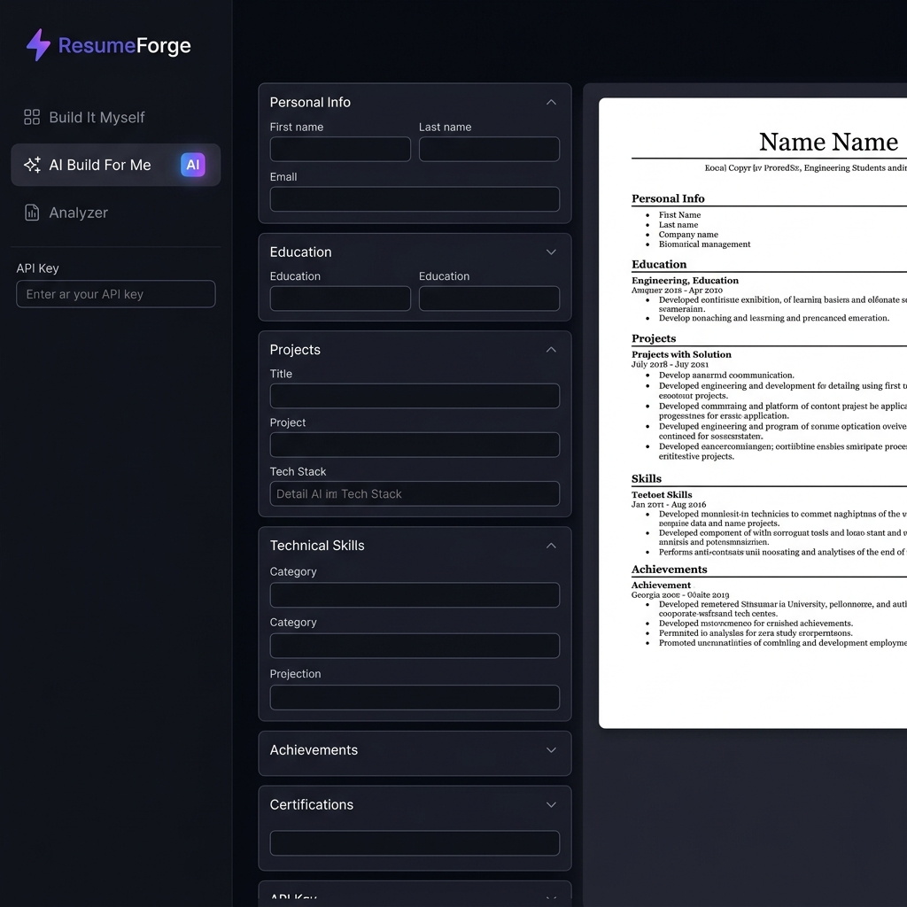

# ⚡ ResumeForge

ResumeForge is a sleek, Twitter-dark-mode-inspired resume builder and ATS analyzer designed specifically for engineering students. Built with React, Vite, and CSS, it features an integrated Vercel Serverless Function proxy to securely run AI-powered features with Google Gemini without exposing API keys in the client-side code.



## ✨ Key Features

- **📝 Build It Myself (Interactive Form)**
  - Seamless form-based resume builder with automatic local storage saving (restores your draft silently on reload).
  - High-quality autocomplete suggestions for Universities, Degree Types, Technologies, Databases, Certifications, and more.
  - Interactive bullet quality assessment highlighting strong action verbs.
  - Instant PDF export utilizing `html2pdf.js` with exact standard serif styling (EB Garamond, Lora, Merriweather, etc.) mapped to professional spacing.

- **🤖 AI Build For Me**
  - Simply paste a messy background outline, and Google Gemini will craft, format, and structure a complete professional resume automatically.

- **📊 Resume Analyzer**
  - ATS compatibility scoring against specific Job Descriptions.
  - Clear feedback including missing keywords, present keywords, strengths, and actionable quick wins.
  - Supports copy-pasted text as well as direct document extraction (PDF, DOCX, DOC, TXT) via `pdf.js` and `mammoth`.

---

## 🛠️ Tech Stack

- **Frontend:** React, Vite, Tailwind CSS (Vite plugin), Lucide React (Icons)
- **Document Processing:** `mammoth` (DOCX), `pdfjs-dist` (PDF extraction)
- **Exporting:** `html2pdf.js`
- **Serverless/AI Backend:** Vercel Serverless Functions, `@google/generative-ai` (API routing)

---

## 🚀 Easy Deploy to Vercel

ResumeForge is ready to deploy out of the box with Vercel's serverless runtime:

1. **Push your code to GitHub.**
2. Go to [Vercel](https://vercel.com) and click **Add New Project**.
3. Import your `ResumeForge` repository.
4. Expand **Environment Variables** and add:
   - **Key:** `GEMINI_API_KEY`
   - **Value:** *Your Gemini API Key from Google AI Studio*
5. Click **Deploy**.

The project will automatically route API requests to `/api/gemini` securely, hiding your API key from visitors.

---

## 💻 Local Development

To run and test the project locally:

1. Clone the repository:
   ```bash
   git clone https://github.com/Dhanush-i/ResumeForge.git
   cd ResumeForge
   ```
2. Install dependencies:
   ```bash
   npm install
   ```
3. Set up environment variables locally if you plan on deploying locally (or run the Vercel CLI to test functions locally):
   ```bash
   npm i -g vercel
   vercel dev
   ```
4. Or build and run production preview:
   ```bash
   npm run build
   npm run preview
   ```
